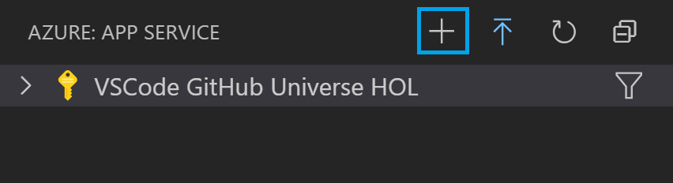
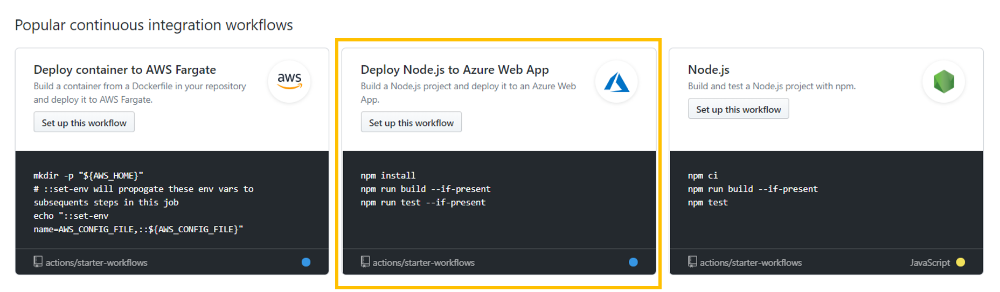
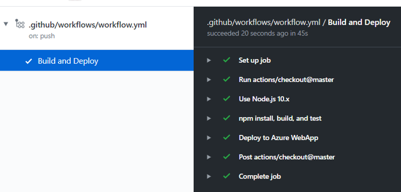

# Deploying a Node.js Web App using GitHub actions

In this lab, you will learn to deploy a Node.js app to Azure App Service and set up a CI/CD workflow using GitHub Actions

## Overview

**GitHub Actions** gives you the flexibility to build an automated software development lifecycle workflow. You can write individual tasks ("Actions") and combine them to create a custom workflow. Workflows are configurable automated processes that you can set up in your repository to build, test, package, release, or deploy any project on GitHub.

With **GitHub Actions** you can build end-to-end continuous integration (CI) and continuous deployment (CD) capabilities directly in your repository. 

### What’s covered in this lab
In this lab, you will:

1. How to set up a workflow with GitHub Actions 

1. Create a workflow with GitHub Actions to add CI/CD to your Node.Js web app


### Prerequisites

1. You will need a **GitHub** account. If you do not have one, you can sign up for free [here](https://github.com/join)

1. **Microsoft Azure Account**: You will need a valid and active Azure account for this lab. If you do not have one, you can sign up for a [free trial](https://azure.microsoft.com/en-us/free/).

1. Your Windows machine should have [Node.js package manager and NPM](https://nodejs.org/en/download), Visual Studio Code, and the VS [Azure App Service extension](vscode:extension/ms-azuretools.vscode-azureappservice) installed, which you can use to create, manage, and deploy Linux Web Apps on the Azure Platform as a Service (PaaS). 

1. Once the extension is installed, log into your Azure account subscription.


### Setting up the GitHub repository

**Node-Express** is an example Node.js web app. Let us clone this repo and open the sample app code in VS Code to get started with this lab.

## Create an Azure App Service

Let's create this as a web app hosted in Azure. 

1. Follow the tutorial [Azure Web Apps Quickstart](https://docs.microsoft.com/en-us/azure/app-service/app-service-web-get-started-nodejs) 

1. Click on the `+` icon to create a new app service under your subscription.

   


1. Give your webapp a unique name

1. Select **Linux** as your OS and **Node** as your runtime. 

1. Browse to your new site! 

## Set up CI/CD with GitHub Actions 

We'll use GitHub actions to automate our deployment workflow for this web app. 

1. In the portal, Overview page, click on "Get publish profile". A publish profile is a kind of deployment credential, useful when you don't own the Azure subscription. Open the downloaded settings file in VS Code and copy the contents of the file.

   


1. We will now add the publish profile as a secret associated with this repo. On the GitHub repository, click on the "Settings" tab.

   


1. Go to "Secrets". Create a new secret called "AZURE_WEBAPP_PUBLISH_PROFILE" and paste the contents from the settings file.

   


1. Now click on "Actions" in the top bar and create a new workflow. 

   


1. Find the **Deploy Node.js to Azure Web App** template and select "Set up this workflow" which creates a new `workflow.yml` file in your repo under `.github/workflows/` folder path

   


1. Let's get into the details of what this workflow is doing.

   - **Workflow Triggers**: Your workflow is set up to run on push events to the branch "master"
     
 ```yaml
  on:
   push:
    branches:
      - master

  ```

   For more information, see [Events that trigger workflows](https://help.github.com/articles/events-that-trigger-workflows).
     
   - **Setting up Environment Variables:** GitHub action workflows can be parameterized using environment variables. For this workflow, Configure the values for the AZURE_WEBAPP_NAME and leave the defaults as is for AZURE_WEBAPP_PACKAGE_PATH and NODE_VERSION variables     

```yaml
env:
  AZURE_WEBAPP_NAME: your-app-name    # set this to your application's name
  AZURE_WEBAPP_PACKAGE_PATH: '.'      # set this to the path to your web app project, defaults to the repository root
  NODE_VERSION: '10.x'                # set this to the node version to use
```
   
   - **Running your jobs on hosted runners:** GitHub Actions provides hosted runners for Linux, Windows, and macOS. Additionally they announced [Beta-release for self-hosted runners](https://github.blog/2019-11-05-self-hosted-runners-for-github-actions-is-now-in-beta/) which you can checkout if interested.
   We specified hosted runner in our workflow as below. 

 ```yaml
jobs:
build-and-deploy:
  name: Build and Deploy
  runs-on: ubuntu-latest
```
   
   - **Using an action**: Actions are reusable units of code that can be built and distributed by anyone on GitHub. To use an action, you must specify the repository that contains the action.
      
  ```yaml
 steps:
 - uses: actions/checkout@master
 - name: Use Node.js ${{ env.NODE_VERSION }}
   uses: actions/setup-node@v1
   with:
     node-version: ${{ env.NODE_VERSION }}

  ```

   - **Running a command**: You can run commands on the job's virtual machine (runner). We are running below NPM commands to install dependencies build, and test our application.

```yaml
 - name: npm install, build, and test
   run: |
     npm install
     npm run build --if-present
     npm run test --if-present

 ```

    >For workflow syntax for GitHub Actions see [here](https://help.github.com/en/github/automating-your-workflow-with-github-actions/workflow-syntax-for-github-actions)

- **Deploy to Azure web app**: Change the `app-name` to the name of your web app. We are using [GitHub Action to deploy Azure Web App ](https://github.com/Azure/webapps-deploy)to deploy to your Azure Web app with the publish profile stored in GitHub secrets which you created previously.

```yaml
 - name: 'Deploy to Azure WebApp'
   uses: azure/webapps-deploy@v1
   with: 
     app-name: ${{ env.AZURE_WEBAPP_NAME }}
     publish-profile: ${{ secrets.AZURE_WEBAPP_PUBLISH_PROFILE }}
     package: ${{ env.AZURE_WEBAPP_PACKAGE_PATH }}

```
   **For more information on GitHub Actions for Azure, refer to https://github.com/Azure/Actions **

   **For more samples to get started with GitHub Action workflows to deploy to Azure, refer to https://github.com/Azure/actions-workflow-samples **

   

- Once you're done editing the workflow by configuring the AZURE_WEBAPP_NAME, click on "Start commit". Committing the file will trigger the workflow.

- You can go back to the Actions tab, click on your workflow, and see that the workflow is queued or being deployed. Wait for the job to complete successfully.

   

## Test out your app!

1. Browse your Node app by pasting the URL of your Azure web app: https://AZURE_WEBAPP_NAME.azurewebsites.net

1. Make any text change by editing the node_express/views/index.pug file and commit the change. Browse to the **Actions** tab in GitHub to view the live logs of your Action workflow which got triggered with the push of the commit.

1.  Once the workflow successfully completes execution, browse back to your website to visualise the new chnages you introduced!
