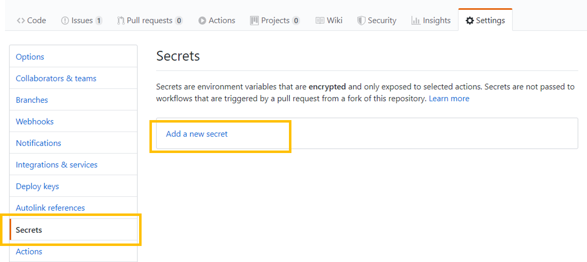
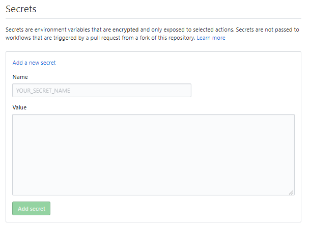
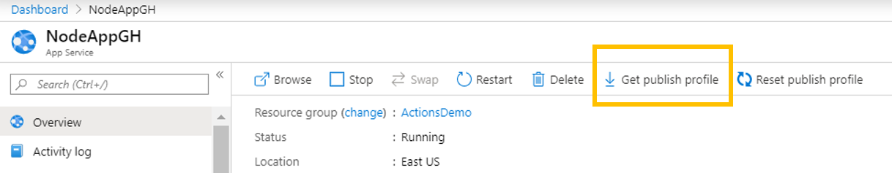

# Set up Secrets in GitHub Action workflows 

[GitHub Secrets](https://help.github.com/en/actions/automating-your-workflow-with-github-actions/creating-and-using-encrypted-secrets) are encrypted and allow you to store sensitive information, such as access tokens, in your repository.

You could use GitHub secrets to store your Azure Credentials, Publish profile of your Web app, container registry credentials or any such sensitive details which are required to automate your CI/CD workflows using GitHub Actions. 

## Creating secrets

1. On GitHub, navigate to the main page of the repository.
1. Under your repository name, click on the "Settings" tab.
1. In the left sidebar, click Secrets.
1. On the right bar, click on "Add a new secret"
   
1. Type a name for your secret in the "Name" input box.
1. Type the value for your secret.
1. Click Add secret.
   
   
   
## Consume secrets in your workflow

To consume a secret within an action workflow, set the secret as an input or environment variable in your workflow. 
Review the action's README file to learn about which inputs and environment variables the action expects. 
For example, most of the [Azure actions](https://github.com/Azure/actions) would need AZURE_CREDENTIALS to be set as a secret.
For more information, see ["Workflow syntax for GitHub Actions."](https://help.github.com/en/articles/workflow-syntax-for-github-actions/#jobsjob_idstepsenv)

```yaml  
steps:
  - name: Sample Azure action
    with: # Set Azure credentials secret as an input
      credentials: ${{ secrets.AZURE_CREDENTIALS }}
    env: # Or as an environment variable
      credentials: ${{ secrets.AZURE_CREDENTIALS }}
```
   
## Set secret with Azure Credentials

Most of the Azure services use user-level Azure credentials i.e., Azure Service Principal for deployments. 

Follow the steps to create the Azure credentials (Service Principal) :
    * Run the below [az cli](https://docs.microsoft.com/en-us/cli/azure/?view=azure-cli-latest) command 
```bash  

   az ad sp create-for-rbac --name "myApp" --role contributor \
                            --scopes /subscriptions/{subscription-id}/resourceGroups/{resource-group} \
                            --sdk-auth
                            
  # Replace {subscription-id}, {resource-group} with the subscription, resource group details

  # The command should output a JSON object similar to this:

  {
    "clientId": "<GUID>",
    "clientSecret": "<GUID>",
    "subscriptionId": "<GUID>",
    "tenantId": "<GUID>",
    (...)
  }
  
```
  * Store the above JSON as the value of a GitHub secret with a name, for example 'AZURE_CREDENTIALS'
  * Now in the workflow file in your branch: `.github/workflows/workflow.yml` replace the secret in Azure login action with your secret name

## Set secret with Web App Publish_Profile
1. In the Azure portal, Navigate to your web app
1. In the Overview page of the app, click on "Get publish profile". A publish profile is a kind of deployment credential, useful when you don't own the Azure subscription. 
1. Open the downloaded settings file in VS Code and copy the contents of the file.
1. Create a new secret in your GitHub repo using the copied contents of the publish profile.

   
