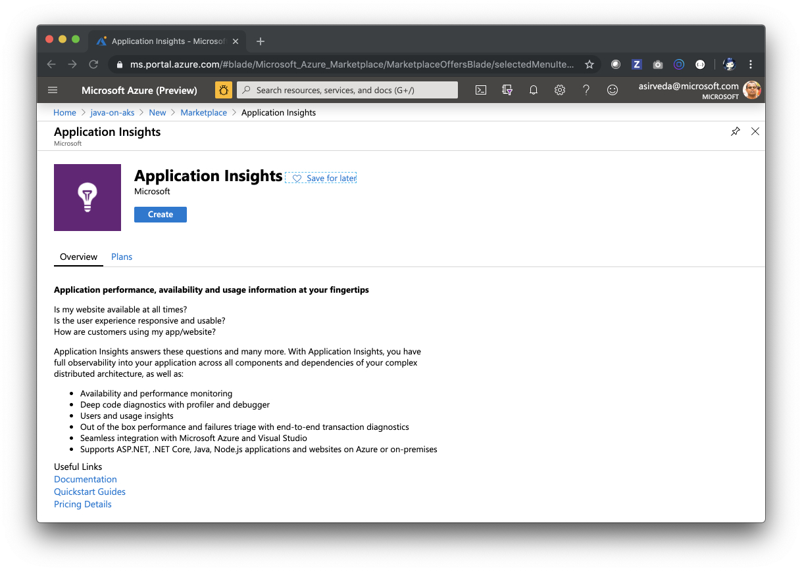
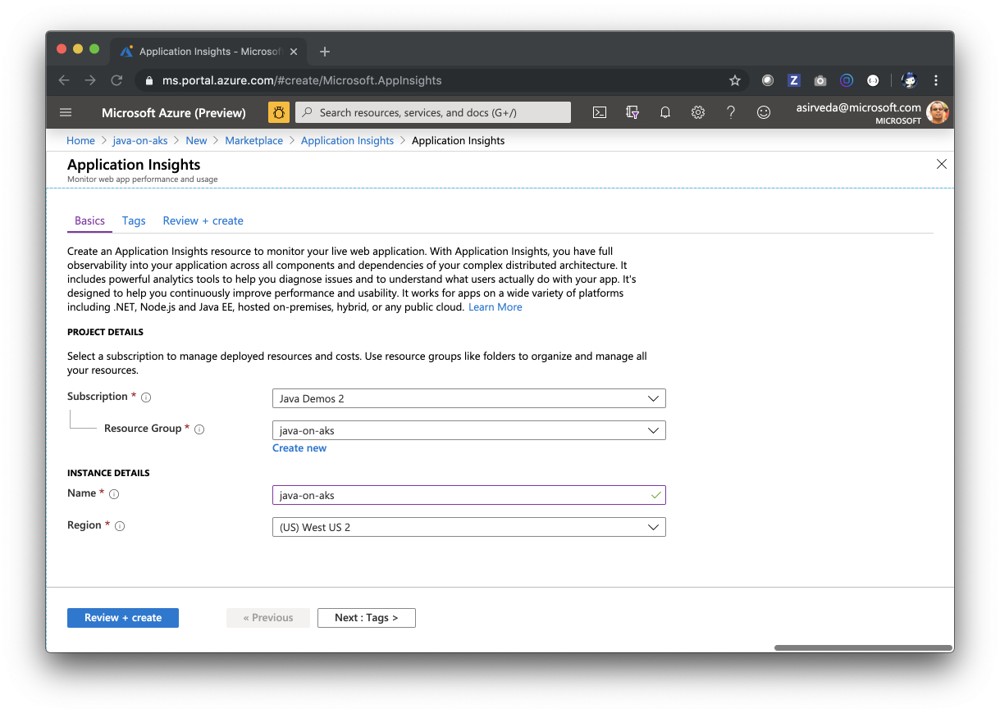

# How to create Application Insights

This guide walks you through how to create an Application Insights 
instance in Azure.

## Create an Application Insights instance

Open the Azure Portal and start:

Go to the created Application Insights and note down the `Instrumentation Key`.

## Resources

- [Create Application Insights](https://docs.microsoft.com/en-us/azure/azure-monitor/app/create-new-resource)

Go back to [How to use AKS end-to-end for Java apps?](https://github.com/azure-samples/java-on-aks)