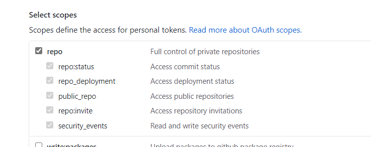
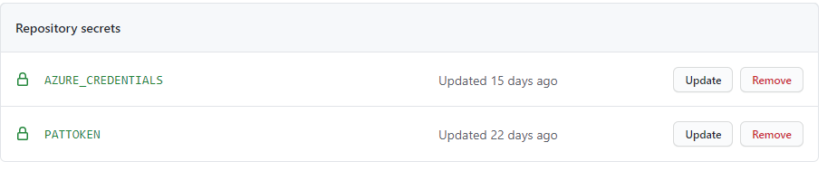
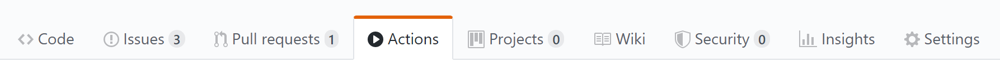

# ML Ops with GitHub Actions and AML

<p align="center">
  
  
  
</p>

This template shows how to perform DevOps for Machine learning applications using [Azure Machine Learning](https://docs.microsoft.com/en-us/azure/machine-learning/) powered [GitHub Actions](). Using this template you will be able to setup your train and deployment infra, train the model and deploy them in an automated manner. 


# Getting started

### 1. Prerequisites

The following prerequisites are required to make this repository work:
- Azure subscription
- Contributor access to the Azure subscription
- Access to [GitHub Actions](https://github.com/features/actions)

If you don’t have an Azure subscription, create a free account before you begin. Try the [free or paid version of Azure Machine Learning](https://aka.ms/AMLFree) today.

### 2. Create repository

To get started with ML Ops, simply create a new repo based off this template, by clicking on the green "Use this template" button:

<p align="center">
  
</p>

### 3. Setting up the required secrets

#### To allow GitHub Actions to access Azure
An [Azure service principal](https://docs.microsoft.com/en-us/azure/active-directory/develop/app-objects-and-service-principals) needs to be generated. Just go to the Azure Portal to find the details of your resource group. Then start the Cloud CLI or install the [Azure CLI](https://docs.microsoft.com/en-us/cli/azure/install-azure-cli?view=azure-cli-latest) on your computer and execute the following command to generate the required credentials:

```sh
# Replace {service-principal-name}, {subscription-id} and {resource-group} with your 
# Azure subscription id and resource group name and any name for your service principle
az ad sp create-for-rbac --name {service-principal-name} \
                         --role contributor \
                         --scopes /subscriptions/{subscription-id}/resourceGroups/{resource-group} \
                         --sdk-auth
```

This will generate the following JSON output:

```sh
{
  "clientId": "<GUID>",
  "clientSecret": "<GUID>",
  "subscriptionId": "<GUID>",
  "tenantId": "<GUID>",
  (...)
}
```

Add this JSON output as [a secret](https://help.github.com/en/actions/configuring-and-managing-workflows/creating-and-storing-encrypted-secrets#creating-encrypted-secrets) with the name `AZURE_CREDENTIALS` in your GitHub repository:

<p align="center">
  
</p>

To do so, click on the Settings tab in your repository, then click on Secrets and finally add the new secret with the name `AZURE_CREDENTIALS` to your repository.

Please follow [this link](https://help.github.com/en/actions/configuring-and-managing-workflows/creating-and-storing-encrypted-secrets#creating-encrypted-secrets) for more details. 

#### To Allow Azure to trigger a GitHub Workflow
 We also need GH PAT token with `repo` access so that we can trigger a GH workflow when the training is completed on Azure Machine Learning. 
 
 <p align="center">
  
</p>
 
 Add the PAT token with as [a secret](https://help.github.com/en/actions/configuring-and-managing-workflows/creating-and-storing-encrypted-secrets#creating-encrypted-secrets) with the name `PATTOKEN` in your GitHub repository:
 <p align="center">
  
</p>

### 4. Define your workspace parameters

We have precreated a [GitHub Workflow file](/.github/workflows/infra_train.yml) that does the infrastructure creation, trains the model and on successful training completions triggers another workflow that deploys the model. 

You need to update [this workspace.json](/.cloud/.azure/workspace.json) `resource_group` parameter with that you have used when generating the azure credentials. You can modify the default workspace used here. You also need to update [this workflow action](/.github/workflows/infra_train.yml#L12) `AZURE_RESOURCE_GROUP` env variable with the generated one. 

Make sure your resource group name in [workspace.json](/.cloud/.azure/workspace.json) are same as that in [workflow](/.github/workflows/infra_train.yml#L12)

Once you save your changes to the file, the predefined GitHub workflow that trains and deploys a model on Azure Machine Learning gets triggered. Check the actions tab to view if your actions have successfully run.

<p align="center">
  
</p>


### 5. Storage Account

You can either create new one or use the existing storage account in the same resource group, You need to make sure that your storage name and `DataLakestorageName` parameter name  specified in [params.deploy.core-infra.json](/infra/params.deploy.core-infra.json#L11) both should match.


### 6. Review 
The above commit would trigger a workflow run and would auto-trigger another [GH Workflow YML]( /.github/workflows/deploy.yml ) which deploys the trained model on an Azure Kubernetes Cluster. The log outputs of your action will provide URLs for you to view the resources that have been created in AML. Alternatively, you can visit the [Machine Learning Studio](https://ml.azure.com/) to view the progress of your runs, etc. For more details, read the documentation below.

### 7. Next Steps: Modify the code

Now you can start modifying the code in the <a href="/code">`code` folder</a>, so that your model and not the provided sample model gets trained on Azure. Where required, modify the environment yaml so that the training and deployment environments will have the correct packages installed in the conda environment for your training and deployment.
Upon pushing the changes, actions will kick off your training and deployment run. Check the actions tab to view if your actions have successfully run.

Comment lines 39 to 55 in your <a href="/.github/workflows/train_deploy.yml">`"/.github/workflows/train_deploy.yml"` file</a> if you only want to train the model. Uncomment line 7 to 8, if you only want to kick off the workflow when pushing changes to the `"/code/"` file.


# Documentation

## Code structure

| File/folder                   | Description                                |
| ----------------------------- | ------------------------------------------ |
| `code`                        | Sample data science source code that will be submitted to Azure Machine Learning to train and deploy machine learning models. |
| `code/train`                  | Sample code that is required for training a model on Azure Machine Learning. |
| `code/train/train.py`         | Training script that gets executed on a cluster on Azure Machine Learning. |
| `code/train/environment.yml`  | Conda environment specification, which describes the dependencies of `train.py`. These packages will be installed inside a Docker image on the Azure Machine Learning compute cluster, when executing your `train.py`. |
| `code/train/run_config.yml`   | YAML files, which describes the execution of your training run on Azure Machine Learning. This file also references your `environment.yml`. Please look at the comments in the file for more details. |
| `code/deploy`                 | Sample code that is required for deploying a model on Azure Machine Learning. |
| `code/deploy/score.py`        | Inference script that is used to build a Docker image and that gets executed within the container when you send data to the deployed model on Azure Machine Learning. |
| `code/deploy/environment.yml` | Conda environment specification, which describes the dependencies of `score.py`. These packages will be installed inside the Docker image that will be used for deploying your model. |
| `code/test/test.py`           | Test script that can be used for testing your deployed webservice. Add a `deploy.json` to the `.cloud/.azure` folder and add the following code `{ "test_enabled": true }` to enable tests of your webservice. Change the code according to the tests that zou would like to execute. |
| `.cloud/.azure`               | Configuration files for the Azure Machine Learning GitHub Actions. Please visit the repositories of the respective actions and read the documentation for more details. |
| `.github/workflows`           | Folder for GitHub workflows. The `train_deploy.yml` sample workflow shows you how your can use the Azure Machine Learning GitHub Actions to automate the machine learning process. |
| `docs`                        | Resources for this README.                 |
| `CODE_OF_CONDUCT.md`          | Microsoft Open Source Code of Conduct.     |
| `LICENSE`                     | The license for the sample.                |
| `README.md`                   | This README file.                          |
| `SECURITY.md`                 | Microsoft Security README.                 |


## Arm template to deploy azure resources
The workflow file 'deploy_infra.yml' uses action 'mlopstemplates/aml_configure' to deploy arm template to azure.
Arm Template is present in './cloud/.azure/' folder (default name='arm_deploy.json') is used to deploy azure resources to azure . It uses the parameters provided in file 'azure.params.json' to create new resources or update the resources if they are already present.
### Documentation of template file parameters

| Parameter                  | Description                                |
| ----------------------------- | ------------------------------------------ |
| `workspaceName`                        | Specifies the name of the Azure Machine Learning workspace.If the resource doesn't exist a new workspace will be created, else existing resource will be updated using the arm template file |
| `baseName`                  | Name used as base-template to name the resources to be deployed in Azure. |
| `OwnerName`         | Owner of this deployment, person to contact for question. |
| `GitHubBranch`  | Name of the branch containing azure function code. |
| `eventGridTopicPrefix`   | The name of the Event Grid custom topic. |
| `eventGridSubscriptionName`                 | The prefix of the Event Grid custom topic's subscription. |
| `FunctionName`        |name of azure function used|
| `subscriptionID` | azure subscription ID being used for deployment |
| `GitHubURL`           | The URL of GitHub (ending by .git) containing azure function code. |
| `funcProjectFolder`               | The name of folder containing the function code. |
| `repo_name`           | The name of repository containing template files.This is picked up from github environment parameter 'GITHUB_REPOSITORY' |
| `pat_token`                        | pat token to be used by the function app to communicate to github via repository dispatch. |


## Documentation of Azure Machine Learning GitHub Actions

The template uses the open source Azure certified Actions listed below. Click on the links and read the README files for more details.
- [aml-workspace](https://github.com/Azure/aml-workspace) - Connects to or creates a new workspace
- [aml-compute](https://github.com/Azure/aml-compute) - Connects to or creates a new compute target in Azure Machine Learning
- [aml-run](https://github.com/Azure/aml-run) - Submits a ScriptRun, an Estimator or a Pipeline to Azure Machine Learning
- [aml-registermodel](https://github.com/Azure/aml-registermodel) - Registers a model to Azure Machine Learning
- [aml-deploy](https://github.com/Azure/aml-deploy) - Deploys a model and creates an endpoint for the model

## Event Grid Subscription
User can modify the deploy_event_grid.json arm template to add/remove the storage events that he/she 
wants to subscribe to [here](https://github.com/mlopstemplates/aml-enterprise-template/blob/ca242dd10b45f0933f83307ba3311d30363f5a22/.cloud/.azure/deploy_event_grid.json#L74)!. These are the available events from storage account :
```sh

Microsoft.Storage.BlobCreated
Microsoft.Storage.BlobDeleted
Microsoft.Storage.BlobRenamed
Microsoft.Storage.DirectoryCreated
Microsoft.Storage.DirectoryRenamed
Microsoft.Storage.DirectoryDeleted

```

## Known issues

### Error: MissingSubscriptionRegistration

Error message: 
```sh
Message: ***'error': ***'code': 'MissingSubscriptionRegistration', 'message': "The subscription is not registered to use namespace 'Microsoft.KeyVault'. See https://aka.ms/rps-not-found for how to register subscriptions.", 'details': [***'code': 'MissingSubscriptionRegistration', 'target': 'Microsoft.KeyVault', 'message': "The subscription is not registered to use namespace 'Microsoft.KeyVault'. See https://aka.ms/rps-not-found for how to register subscriptions
```
Solution:

This error message appears, in case the `Azure/aml-workspace` action tries to create a new Azure Machine Learning workspace in your resource group and you have never deployed a Key Vault in the subscription before. We recommend to create an Azure Machine Learning workspace manually in the Azure Portal. Follow the [steps on this website](https://docs.microsoft.com/en-us/azure/machine-learning/tutorial-1st-experiment-sdk-setup#create-a-workspace) to create a new workspace with the desired name. After ou have successfully completed the steps, you have to make sure, that your Service Principal has access to the resource group and that the details in your <a href="/.cloud/.azure/workspace.json">`/.cloud/.azure/workspace.json"` file</a> are correct and point to the right workspace and resource group.

# What is MLOps?

<p align="center">
  
</p>

MLOps empowers data scientists and machine learning engineers to bring together their knowledge and skills to simplify the process of going from model development to release/deployment. ML Ops enables you to track, version, test, certify and reuse assets in every part of the machine learning lifecycle and provides orchestration services to streamline managing this lifecycle. This allows practitioners to automate the end to end machine Learning lifecycle to frequently update models, test new models, and continuously roll out new ML models alongside your other applications and services.

This repository enables Data Scientists to focus on the training and deployment code of their machine learning project (`code` folder of this repository). Once new code is checked into the `code` folder of the master branch of this repository the GitHub workflow is triggered and open source Azure Machine Learning actions are used to automatically manage the training through to deployment phases.

# Contributing

This project welcomes contributions and suggestions.  Most contributions require you to agree to a
Contributor License Agreement (CLA) declaring that you have the right to, and actually do, grant us
the rights to use your contribution. For details, visit https://cla.opensource.microsoft.com.

When you submit a pull request, a CLA bot will automatically determine whether you need to provide
a CLA and decorate the PR appropriately (e.g., status check, comment). Simply follow the instructions
provided by the bot. You will only need to do this once across all repos using our CLA.

This project has adopted the [Microsoft Open Source Code of Conduct](https://opensource.microsoft.com/codeofconduct/).
For more information see the [Code of Conduct FAQ](https://opensource.microsoft.com/codeofconduct/faq/) or
contact [opencode@microsoft.com](mailto:opencode@microsoft.com) with any additional questions or comments.
